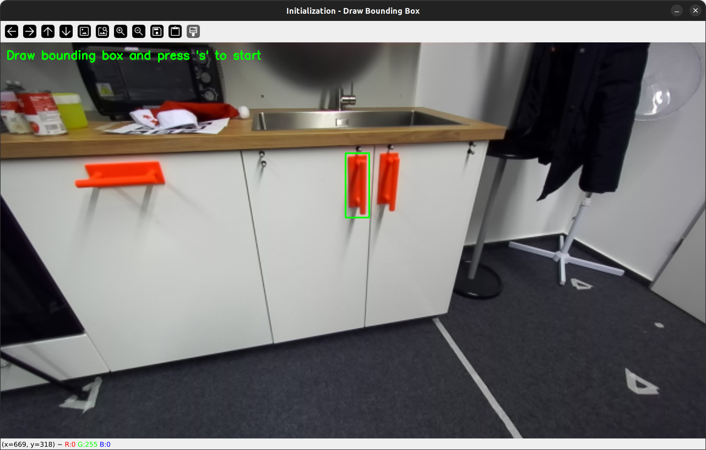
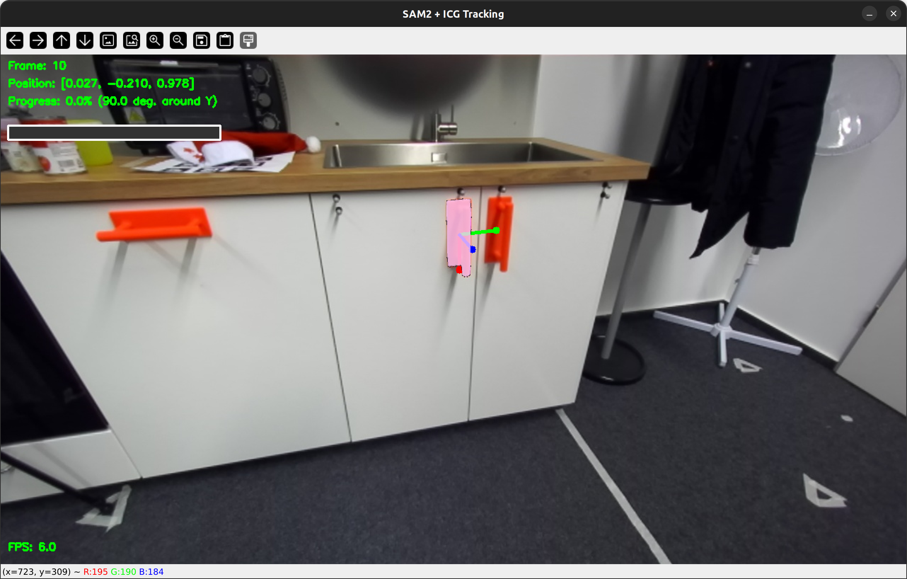
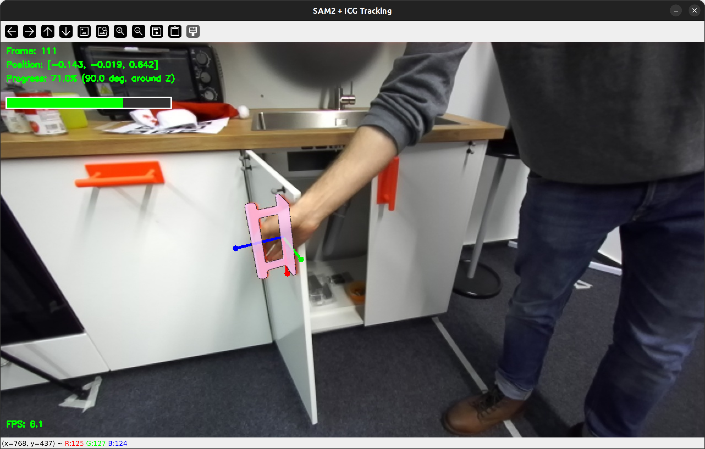

# Articulation Tracker
This repository provides tools for **estimating the articulation state of objects** by combining semantic segmentation (SAM2) with 6D pose tracking. It is designed to track articulated objects such as handles, drawers, and doors using RGB-D data and to monitor the progress for tasks like opening doors or drawers.


## Overview

The system follows a modular pipeline:
1. **RGB-D Input**: Live ZED camera or pre-recorded sequences
2. **Semantic Segmentation**: SAM2 (Segment Anything Model 2) for object segmentation
3. **Point Cloud Extraction**: Convert segmented depth data to 3D point clouds
4. **Pose Tracking**: Two approaches available (ICP or ICG)
5. **Progress Monitoring**: Calculate articulation progress based on pose changes


## Tracking Approaches

We provide two approaches (ICP and ICG) to track the pose of a target object such as a handle.
Both trackers use SAM2 for initial segmentation, but only ICP tracker continues using SAM2 for mask propagation.

### 1. SAM2 + ICP Tracker (`sam2_icp_tracker.py`)

Frame-to-frame tracking using Iterative Closest Point (ICP) without requiring a CAD model.

**Initialization**:
- User draws a bounding box around the target object in the first frame
- SAM2 segments the object based on the bounding box
- Point cloud is extracted from the segmented depth data
- First frame's point cloud is stored as the **reference frame**

**Tracking Loop**:
- SAM2 propagates the mask to subsequent frames
- Point cloud is extracted from each new frame
- **ICP** aligns the current frame's point cloud with the previous frame's point cloud
- Transformations are composed to maintain pose in the reference frame coordinate system

**Features**:
- **Reference Frame Re-registration**: Periodically re-registers with the first frame to correct drift
- **Rotation Constraints**: Validate and smooth rotations based on maximum angular velocity


### 2. SAM2 + ICG Tracker (`sam2_icg_tracker.py`)

Model-based tracking using ICG (Iterative Corresponding Geometry) with a CAD model.


**Initialization**:
- User draws a bounding box around the target object in the first frame
- SAM2 segments the object based on the bounding box
- Point cloud is extracted from the segmented depth data
- **Global Registration**: The observed point cloud is matched against a CAD model using RANSAC to find the initial pose
- Initial pose is passed to the ICG tracker

**Tracking Loop**:
- ICG tracker estimates pose for each RGB frame
- Uses the CAD model and region-based tracking
- No SAM2 segmentation needed after initialization (ICG handles tracking)

**Features**:
   - **CAD Model Integration**: Requires a 3D model (.obj file) of the object
   - **Progress Tracking**: Calculates articulation progress (rotation, translation, or distance)


## Progress Tracking Modes

1. **Rotation** (`--progress_mode rotation`):
   - Tracks rotation around a specified axis (x, y, z, or auto-detect)
   - Progress calculated as percentage of goal rotation (e.g., 90° door opening)

2. **Translation** (`--progress_mode translation`):
   - Tracks translation along a specified axis (x, y, z, or auto-detect)
   - Progress calculated as percentage of goal translation (e.g., 0.5m drawer opening)

3. **Distance** (`--progress_mode distance`):
   - Tracks Euclidean distance from reference pose
   - Progress calculated as percentage of goal distance


## Demo

The following example shows how to estimate the articulation state of a cabinet door by tracking the pose of the handle using the SAM2 + ICG Tracker. The progress is dependent on the current and a goal rotation.

```
python sam2_icg_tracker.py \
    --camera_source recorded \
    --recorded_root path/to/zed_stream \
    --camera_metafile path/to/zed_color.yaml \
    --body_metafile path/to/handle.yaml \
    --cad_model_path path/to/handle.obj \
    --progress_mode rotation \
    --goal_rotation 90 \
    --render_model
```

<p align="center">
 
    <br> 
    <em>Drawing a bounding box around the target object</em>
</p>

<p align=center>
 
 
 <br> 
    <em>Tracking the pose of the object and calculating the articulation state</em>
</p>

## Setup and Installation

This project requires Python ≥ 3.11, PyTorch with CUDA support, SAM-2, and ICG pose estimation with Python bindings.

#### 1. Create and activate a Conda environment
```
conda create -n articulation python=3.11 -y
conda activate articulation
```

#### 2. Install PyTorch and TorchVision
Install PyTorch>=2.3.1 and TorchVision>=0.18.1 by following the official instructions [here](https://pytorch.org/get-started/locally/).


#### 3. Install SAM-2
Clone the [SAM-2 repository](https://github.com/facebookresearch/sam2):
```
git clone https://github.com/facebookresearch/sam2.git
cd sam2 
```

Install required Python dependencies:
```
pip install matplotlib opencv-python opencv-contrib-python
```

Install SAM-2 in editable mode:
```
pip install -e .
```
If there are dependency conflicts (e.g. PyTorch version warnings), reinstall using the flag ```--no-deps```.

Download SAM-2 model checkpoints:
```
cd checkpoints && \
./download_ckpts.sh && \
cd ..

```

#### 4. Install ICG (with Python bindings)
Next, install a slightly modified version of the [ICG](https://github.com/DLR-RM/3DObjectTracking/tree/master/ICG) pose estimation framework.
This fork extends the original implementation by adding Python bindings enabling seamless integration with our Python-based codebase.
 

Clone the custom branch that includes the Python bindings:
```
git clone --branch pybindings https://github.com/mrchris7/pose-estimation.git
cd pose-estimation
```

Install system dependencies:
```
sudo apt-get install libglfw3-dev libeigen3-dev libglew-dev
```

Build the project:
```
cd build
cmake ..
cmake --build .
```

#### 5. Install the Articulation Tracker

Clone this repository:
```
https://github.com/mrchris7/articulation-tracker.git
cd articulation-tracker
```

Add additional Python dependencies:
```
pip install open3d
```


## Acknowledgements

This project builds upon and integrates existing work. We would like to express our sincere gratitude to the authors and contributors of the following work:
- Segment Anything Model 2 (SAM-2) available at: https://github.com/facebookresearch/sam2

- Iterative Corresponding Geometry (ICG) available at: https://github.com/DLR-RM/3DObjectTracking/tree/master/ICG

